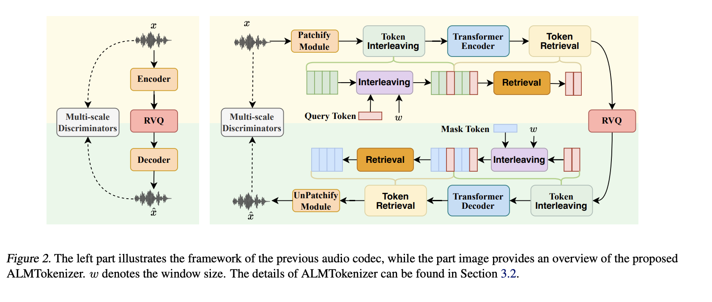

# 
 ALMTokenizer: A Low-bitrate and Semantic-rich Audio Codec Tokenizer for Audio Language Modeling 

## Introduction
Recent advancements in audio language models have underscored the pivotal role of audio tokenization, which converts audio signals into discrete tokens, thereby facilitating the application of language model architectures to the audio domain. In this study, we introduce ALMTokenizer, a novel low-bitrate and semantically rich audio codec tokenizer for audio language models. Prior methods, such as Encodec, typically encode individual audio frames into discrete tokens without considering the use of context information across frames. Unlike these methods, we introduce a novel query-based compression strategy to capture holistic information with a set of learnable query tokens by explicitly modeling the context information across frames. This design not only enables the codec model to capture more semantic information but also encodes the audio signal with fewer token sequences. Additionally, to enhance the semantic information in audio codec models, we introduce the following: (1) A masked autoencoder (MAE) loss, (2) Vector quantization based on semantic priors, and (3) An autoregressive (AR) prediction loss. As a result, ALMTokenizer achieves competitive reconstruction performance relative to state-of-the-art approaches while operating at a lower bitrate. Within the same audio language model framework, ALMTokenizer outperforms previous tokenizers in audio understanding and generation tasks.

## Overview
The overview of ALMTokenizer as following picture shows.

In the following, we will show some generated samples by our proposed method. 

## Audio Codec Tokenizer Reconstruction Comparison (Speech)

| Original Speech | 
 DAC (1.5kbps) 
 | 
 Encodec (1.5kbps) 
| 
 WavTokenizer (0.48kbps) 
 | 
 StableCodec (0.4kbps) 
 | 
 SpeechTokenizer (1.5kbps) 
 |
 Mimi (1.1kbps) 
 | 
 Mimi (0.41kbps) 
 | 
 Ours (0.41kbps) 
 |
| -----------------------     |  -----------   | ------ | ----- |
| <audio class="audio-player2" src="codec/speech/gt/p225_001.wav" controls preload></audio>   | <audio class="audio-player2" src="codec/speech/dac/p225_001.wav" controls preload></audio> | <audio class="audio-player2" src="codec/speech/encodec/p225_001.wav" controls preload></audio> |  <audio class="audio-player2" src="codec/speech/wavtokenizer/p225_001.wav" controls preload></audio> |  <audio class="audio-player2" src="codec/speech/stablecodec/p225_001.wav" controls preload></audio> |<audio class="audio-player2" src="codec/speech/speechtokenizer/p225_001.wav" controls preload></audio> |<audio class="audio-player2" src="codec/speech/mimi_8layer/p225_001.wav" controls preload></audio> |<audio class="audio-player2" src="codec/speech/mimi_3layer/p225_001.wav" controls preload></audio> |<audio class="audio-player2" src="codec/speech/ours/p225_001.wav" controls preload></audio> |
| <audio class="audio-player2" src="codec/speech/gt/p225_002.wav" controls preload></audio>   | <audio class="audio-player2" src="codec/speech/dac/p225_002.wav" controls preload></audio> | <audio class="audio-player2" src="codec/speech/encodec/p225_002.wav" controls preload></audio> |  <audio class="audio-player2" src="codec/speech/wavtokenizer/p225_002.wav" controls preload></audio> |  <audio class="audio-player2" src="codec/speech/stablecodec/p225_002.wav" controls preload></audio> |<audio class="audio-player2" src="codec/speech/speechtokenizer/p225_002.wav" controls preload></audio> |<audio class="audio-player2" src="codec/speech/mimi_8layer/p225_002.wav" controls preload></audio> |<audio class="audio-player2" src="codec/speech/mimi_3layer/p225_002.wav" controls preload></audio> |<audio class="audio-player2" src="codec/speech/ours/p225_002.wav" controls preload></audio> |
| <audio class="audio-player2" src="codec/speech/gt/p225_003.wav" controls preload></audio>   | <audio class="audio-player2" src="codec/speech/dac/p225_003.wav" controls preload></audio> | <audio class="audio-player2" src="codec/speech/encodec/p225_003.wav" controls preload></audio> |  <audio class="audio-player2" src="codec/speech/wavtokenizer/p225_003.wav" controls preload></audio> |  <audio class="audio-player2" src="codec/speech/stablecodec/p225_003.wav" controls preload></audio> |<audio class="audio-player2" src="codec/speech/speechtokenizer/p225_003.wav" controls preload></audio> |<audio class="audio-player2" src="codec/speech/mimi_8layer/p225_003.wav" controls preload></audio> |<audio class="audio-player2" src="codec/speech/mimi_3layer/p225_003.wav" controls preload></audio> |<audio class="audio-player2" src="codec/speech/ours/p225_003.wav" controls preload></audio> |
| <audio class="audio-player2" src="codec/speech/gt/p225_004.wav" controls preload></audio>   | <audio class="audio-player2" src="codec/speech/dac/p225_004.wav" controls preload></audio> | <audio class="audio-player2" src="codec/speech/encodec/p225_004.wav" controls preload></audio> |  <audio class="audio-player2" src="codec/speech/wavtokenizer/p225_004.wav" controls preload></audio> |  <audio class="audio-player2" src="codec/speech/stablecodec/p225_004.wav" controls preload></audio> |<audio class="audio-player2" src="codec/speech/speechtokenizer/p225_004.wav" controls preload></audio> |<audio class="audio-player2" src="codec/speech/mimi_8layer/p225_004.wav" controls preload></audio> |<audio class="audio-player2" src="codec/speech/mimi_3layer/p225_004.wav" controls preload></audio> |<audio class="audio-player2" src="codec/speech/ours/p225_004.wav" controls preload></audio> |
| <audio class="audio-player2" src="codec/speech/gt/p226_002.wav" controls preload></audio>   | <audio class="audio-player2" src="codec/speech/dac/p226_002.wav" controls preload></audio> | <audio class="audio-player2" src="codec/speech/encodec/p226_002.wav" controls preload></audio> |  <audio class="audio-player2" src="codec/speech/wavtokenizer/p226_002.wav" controls preload></audio> |  <audio class="audio-player2" src="codec/speech/stablecodec/p226_002.wav" controls preload></audio> |<audio class="audio-player2" src="codec/speech/speechtokenizer/p226_002.wav" controls preload></audio> |<audio class="audio-player2" src="codec/speech/mimi_8layer/p226_002.wav" controls preload></audio> |<audio class="audio-player2" src="codec/speech/mimi_3layer/p226_002.wav" controls preload></audio> |<audio class="audio-player2" src="codec/speech/ours/p226_002.wav" controls preload></audio> |
| <audio class="audio-player2" src="codec/speech/gt/p231_001.wav" controls preload></audio>   | <audio class="audio-player2" src="codec/speech/dac/p231_001.wav" controls preload></audio> | <audio class="audio-player2" src="codec/speech/encodec/p231_001.wav" controls preload></audio> |  <audio class="audio-player2" src="codec/speech/wavtokenizer/p231_001.wav" controls preload></audio> |  <audio class="audio-player2" src="codec/speech/stablecodec/p231_001.wav" controls preload></audio> |<audio class="audio-player2" src="codec/speech/speechtokenizer/p231_001.wav" controls preload></audio> |<audio class="audio-player2" src="codec/speech/mimi_8layer/p231_001.wav" controls preload></audio> |<audio class="audio-player2" src="codec/speech/mimi_3layer/p231_001.wav" controls preload></audio> |<audio class="audio-player2" src="codec/speech/ours/p231_001.wav" controls preload></audio> |
| <audio class="audio-player2" src="codec/speech/gt/p231_002.wav" controls preload></audio>   | <audio class="audio-player2" src="codec/speech/dac/p231_002.wav" controls preload></audio> | <audio class="audio-player2" src="codec/speech/encodec/p231_002.wav" controls preload></audio> |  <audio class="audio-player2" src="codec/speech/wavtokenizer/p231_002.wav" controls preload></audio> |  <audio class="audio-player2" src="codec/speech/stablecodec/p231_002.wav" controls preload></audio> |<audio class="audio-player2" src="codec/speech/speechtokenizer/p231_002.wav" controls preload></audio> |<audio class="audio-player2" src="codec/speech/mimi_8layer/p231_002.wav" controls preload></audio> |<audio class="audio-player2" src="codec/speech/mimi_3layer/p231_002.wav" controls preload></audio> |<audio class="audio-player2" src="codec/speech/ours/p231_002.wav" controls preload></audio> |
| <audio class="audio-player2" src="codec/speech/gt/p232_001.wav" controls preload></audio>   | <audio class="audio-player2" src="codec/speech/dac/p232_001.wav" controls preload></audio> | <audio class="audio-player2" src="codec/speech/encodec/p232_001.wav" controls preload></audio> |  <audio class="audio-player2" src="codec/speech/wavtokenizer/p232_001.wav" controls preload></audio> |  <audio class="audio-player2" src="codec/speech/stablecodec/p232_001.wav" controls preload></audio> |<audio class="audio-player2" src="codec/speech/speechtokenizer/p232_001.wav" controls preload></audio> |<audio class="audio-player2" src="codec/speech/mimi_8layer/p232_001.wav" controls preload></audio> |<audio class="audio-player2" src="codec/speech/mimi_3layer/p232_001.wav" controls preload></audio> |<audio class="audio-player2" src="codec/speech/ours/p232_001.wav" controls preload></audio> |
| <audio class="audio-player2" src="codec/speech/gt/p266_005.wav" controls preload></audio>   | <audio class="audio-player2" src="codec/speech/dac/p266_005.wav" controls preload></audio> | <audio class="audio-player2" src="codec/speech/encodec/p266_005.wav" controls preload></audio> |  <audio class="audio-player2" src="codec/speech/wavtokenizer/p266_005.wav" controls preload></audio> |  <audio class="audio-player2" src="codec/speech/stablecodec/p266_005.wav" controls preload></audio> |<audio class="audio-player2" src="codec/speech/speechtokenizer/p266_005.wav" controls preload></audio> |<audio class="audio-player2" src="codec/speech/mimi_8layer/p266_005.wav" controls preload></audio> |<audio class="audio-player2" src="codec/speech/mimi_3layer/p266_005.wav" controls preload></audio> |<audio class="audio-player2" src="codec/speech/ours/p266_005.wav" controls preload></audio> |

